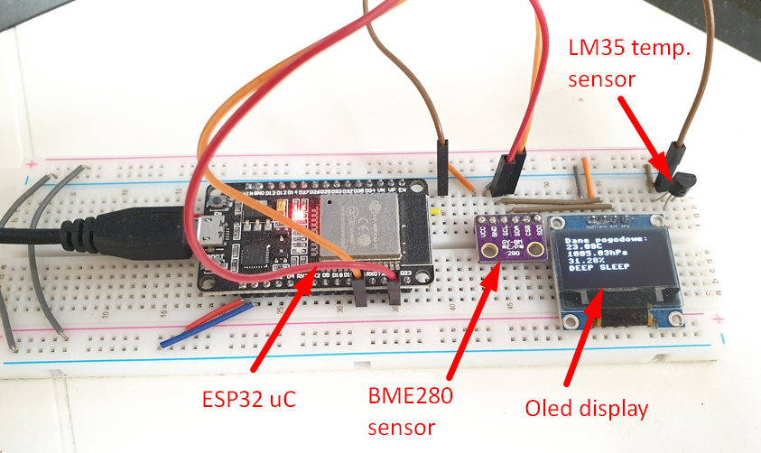
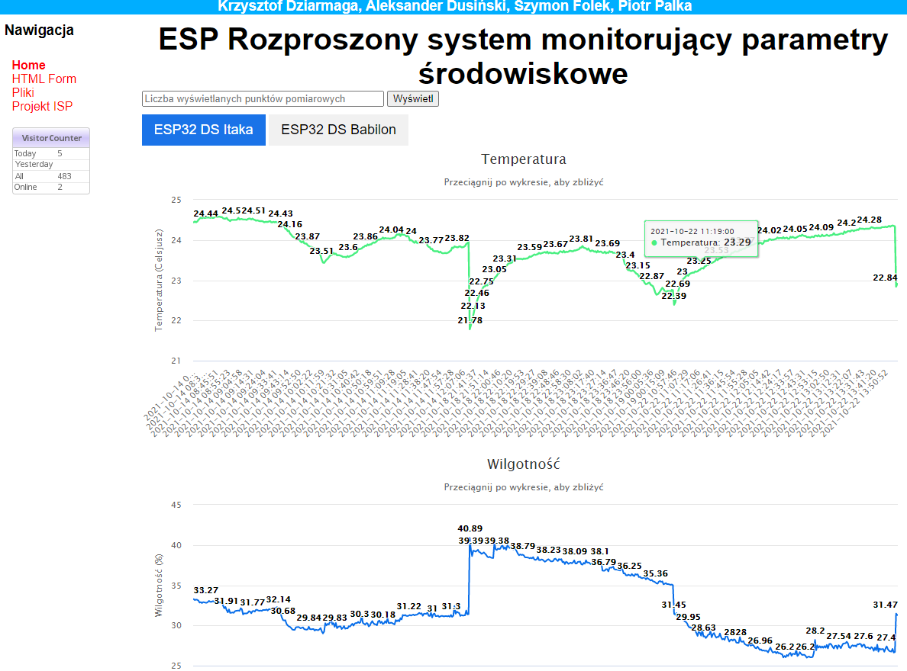

# Distributed_Measurement_System

The topic of the project was to develop a measurement system based on multiple ESP-32 microcontrollers. The aim is acquisition of  enviromental conditions & their visualization using a database, php and html scripts. Temperature, Humidity and Pressure are visualized on my website in AGH domain availiabe here:

https://student.agh.edu.pl/~dziarmag/esp-chart.php

ESP32 uC uses a 3 in 1 bme280 sensor to measure Temperature, Humidity and Pressure. It is also equipped in oled display to show results on the screen.

## Connected circuit:

## Data viaualization on website:
Environmental conditions are measured in two AGH dormitories: Itaka and Babilon. Parameters are send and stored in SQL database. They are also visualized on the webpage:

